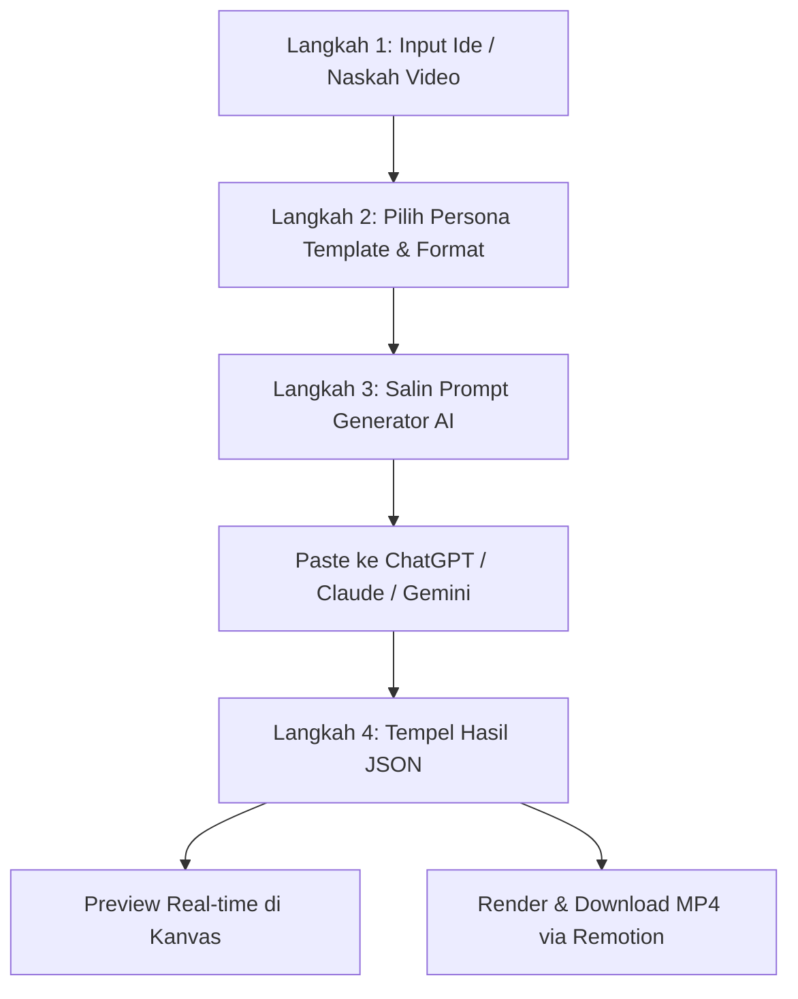

# Design Specification: Streamlined 4-Step Persona & Prompt Workflow

**Date:** 2026-09-27  
**Status:** Approved  
**Author:** Antigravity & Pair Developer  

---

## 1. Overview & Objective

MotionCraft Studio saat ini memiliki tombol dan fitur yang tersebar di beberapa tempat (header toolbar, modal pop-up naskah converter, modal JSON editor, dan sidebar panel). Pengguna membutuhkan alur kerja yang **runtut, terarah, dan minim friksi** tanpa harus membuka-tutup banyak modal dialog.

Tujuan desain ini adalah:
1. **Merapikan seluruh tombol di antarmuka**, menghilangkan tombol redundan di header, dan memusatkan alur pembuatan video ke panel kiri (Workbench) dalam bentuk **4-Step Linear Pipeline**.
2. **Menyediakan 4 Persona Template** (*Tech & Code*, *Fintech & Data*, *Content Creator*, *Edukasi & Bisnis*) yang memberikan identitas visual, tone narasi, dan archetypes Remotion yang selaras.
3. **Mengintegrasikan Prompt Generator AI langsung di Langkah 3** yang memungkinkan 1-klik salin (*Copy Prompt*) dengan format siap pakai di ChatGPT, Claude, atau Gemini.
4. **Menyediakan Kotak Tempel JSON di Langkah 4** agar user dapat langsung menempelkan output JSON dari AI dan merender video Motion Graphic (MP4) secara instan.

---

## 2. User Journey & Workflow (The 4 Steps)



### Detail Setiap Langkah:

1. **Langkah 1: Topik / Deskripsi Video**
   - Area textarea yang luas dan nyaman untuk menulis deskripsi singkat, outline materi, maupun naskah lengkap.
   - Dilengkapi *Quick Topic Chips* untuk inspirasi instan.

2. **Langkah 2: Persona Template & Format Video**
   - **4 Persona Pilihan**:
     - 🚀 **Tech & Code**: Fokus pada terminologi tech, arsitektur modular, jendela kode syntax, dan UI monospace.
     - 📊 **Fintech & Data**: Fokus pada metrik persentase, analitik, kartu glassmorphism, dan tone kredibel.
     - 🎬 **Content Creator**: Hook 3 detik punchy, tipografi kinetik tebal, aksen warna kontras, gaya TikTok/Reels.
     - 📚 **Edukasi & Bisnis**: Langkah terstruktur (*checklist*), perbandingan *sebelum vs sesudah*, dan CTA konversi.
   - **Format Kanvas**: Aspect ratio (9:16, 4:5, 1:1, 16:9) dan Durasi Target (30s, 60s, 90s, 120s).

3. **Langkah 3: Prompt Generator untuk AI Eksternal**
   - Sistem secara otomatis menggabungkan topik user + persona terpilih + format durasi ke dalam satu **Master Prompt Remotion** yang sangat presisi.
   - Tombol utama: **`📋 Salin Prompt untuk ChatGPT / Claude`**.
   - Ketika ditekan: teks prompt tersalin ke clipboard, tombol menampilkan indikator visual `✅ Prompt Tersalin!`, dan instruksi ramah memandu user ke langkah berikutnya.
   - Opsi sekunder: Tombol kecil `Lihat Prompt` untuk menginspeksi teks instruksi.

4. **Langkah 4: Tempel JSON & Eksekusi**
   - Textarea input JSON yang siap menerima output dari LLM.
   - Dilengkapi tombol upload file `.json` sebagai alternatif.
   - Dua tombol aksi jelas:
     - **`⚡ Terapkan & Render MP4`** (Tombol primer, langsung mengaktifkan Remotion Chromium headless render).
     - **`👁️ Preview Saja`** (Tombol sekunder, memperbarui playback kanvas tanpa render MP4).

---

## 3. UI Header Cleanup (Perapihan Tombol)

Tombol yang sebelumnya menumpuk di Top Header dipangkas dan dirapikan:

- **Dihapus dari Header** (karena sudah menyatu di Linear Pipeline sidebar):
  - `Script to JSON` (pindah ke Step 3 & 4)
  - `Upload JSON` (pindah ke Step 4)
  - `Editor JSON` (pindah ke Step 4)
- **Dipertahankan di Header**:
  - Brand identity: **MotionCraft Studio v2.5**
  - Active Composition Status Badge
  - Utilitas Audio: **`DSP Audio`** (preview procedural music & sfx)
  - Riwayat: **`Galeri`** (melihat daftar MP4 yang sudah jadi)
  - Konfigurasi: **`Pengaturan`** (opsional API key)

---

## 4. Persona Templates Specification

| Persona Key | Nama Tampilan | Tone Narasi | Preset Warna Default | Archetypes Dominan |
|---|---|---|---|---|
| `tech-code` | **Tech & Code** | Tajam, analitis, developer-centric | `tech-neon-soft` (Cyber Monospace) | `code_window_react`, `terminal_cli_render`, `timeline_flow` |
| `fintech-data` | **Fintech & Data** | Kredibel, berbasis data, profesional | `pi-v2-dark` / `hyper-crypto` | `stat_focus`, `metric_counter`, `split_screen` |
| `creator-story` | **Content Creator** | Enerjik, rasa ingin tahu tinggi, viral hook | `sunset-creator` (Sunset Flame) | `hero_typography`, `hook_kinetic`, `kinetic_checklist` |
| `edu-business` | **Edukasi & Bisnis** | Edukatif, solusi praktis, konseptual | `remotion-light` / `warm-paper` | `kinetic_checklist`, `split_screen`, `cinematic_quote` |

---

## 5. Master Prompt Generator Specification

Fungsi `generateMasterPrompt(topic, personaKey, durationSec, platform, fps)` menghasilkan prompt dengan format:

```text
Kamu adalah MotionCraft Director khusus persona [PERSONA_NAME].
Tugasmu: Mengonversi materi berikut menjadi komposisi video Remotion (composition.json).

MATERI / TOPIK:
"""
[USER_TOPIC_OR_SCRIPT]
"""

PANDUAN PERSONA:
- Tone: [PERSONA_TONE]
- Visual Archetypes yang disarankan: [ARCHETYPES]
- Durasi Total: [DURATION_SEC] detik ([TOTAL_FRAMES] frames, [FPS] fps)

PANDUAN JSON REMOTION:
Wajib menghasilkan format JSON murni tanpa markdown pembungkus:
{
  "title": "Judul Ringkas",
  "fps": 30,
  "durationSec": [DURATION_SEC],
  "style": "[STYLE_PRESET]",
  "scenes": [
    {
      "tag": "01 / INTRO",
      "headline": "Judul scene dengan *highlight*",
      "subtext": "Narasi pendukung ringkas (1-2 kalimat).",
      "durationFrames": 120
    }
  ]
}
```

---

## 6. Implementation Architecture & Affected Files

1. **`public/sections/header.html`**:
   - Rapikan action bar: hapus tombol Script to JSON, Upload, dan Editor.
   - Sisa kontrol: Audio DSP preview, Galeri render, Pengaturan studio.
2. **`public/sections/workbench.html`**:
   - Ubah isi sidebar menjadi **4-Step Linear Pipeline**:
     - Step 1: Textarea topik / materi.
     - Step 2: Grid 4 kartu Persona + Grid Aspect Ratio + Durasi.
     - Step 3: Action bar copy prompt generator AI.
     - Step 4: Textarea JSON input + tombol Render MP4 & Preview.
     - Drawer/tab alternatif untuk Scene Inspector tetap tersedia jika ingin inspeksi timeline per scene.
3. **`public/sections/modals.html`**:
   - Hapus `promptGenModal` dan `jsonEditorModal` karena alur sudah terintegrasi langsung di workbench.
   - Pertahankan `galleryModal`, `settingsModal`, dan `renderProgressModal`.
4. **`public/js/studio.js`**:
   - Tambahkan state `selectedPersona` (default: `creator-story`).
   - Implementasikan fungsi `selectPersona(key)`.
   - Implementasikan fungsi `copyMasterPromptToClipboard()`.
   - Implementasikan fungsi `applyStep4JsonAndRender()` dan `applyStep4JsonPreview()`.
   - Hapus modal handler lama yang sudah usang.
5. **`server.js`**:
   - Menjamin auto-compose berjalan mulus dan server tetap responsif (HTTP 200).

---

## 7. Verification & Acceptance Criteria

1. **UI Layout**:
   - Sidebar kiri menampilkan 4 langkah berurutan dengan label nomor yang jelas (Langkah 1 s/d 4).
   - Header atas bersih dan tombol tidak berdesakan.
2. **Persona Selection**:
   - Mengklik kartu persona memberikan feedback visual aktif (*ring* / border kontras).
3. **Prompt Copying**:
   - Mengklik tombol Salin Prompt menyalin teks prompt ke clipboard dan memberikan status "Tersalin!".
4. **JSON Application & Render**:
   - Menempelkan JSON yang valid ke Step 4 dan mengklik `Terapkan & Render MP4` memicu validasi, pembaruan kanvas, dan eksekusi render Remotion headless tanpa error.
   - Semua 69 DOM ID inti tetap valid dan bebas dari error console.
